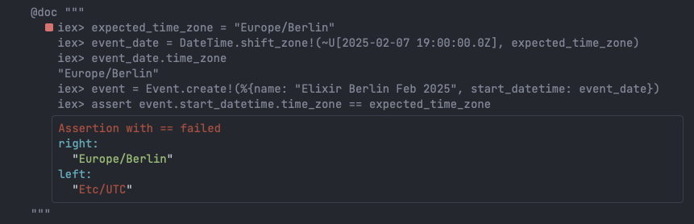

+++
date = '2025-01-18T12:01:00+01:00'
draft = true
title = 'Ecto Datetime With Time Zone'
featured_image = '/posts/posts/ecto-datetime-with-time-zone/cover.jpg'
+++

A few days ago, while implementing a feature to store event dates, I stumbled upon what I initially thought was a straightforward task: saving future dates in a database along with their time zones. How hard could it be, right? Turns out, it’s not so simple.


### The first Attemp: TIMESTAMP WITH TIME ZONE

My first approach was to use PostgreSQL’s `TIMESTAMP WITH TIME ZONE` column type.

```elixir
  schema "events_v1" do
    field(:name, :string)
    field(:start_datetime, :utc_datetime)
  end
```

After all, it has “WITH TIME ZONE” right in the name! But I quickly discovered two key issues:

1. Automatic UTC Conversion: When you store a timestamp with time zone, PostgreSQL converts it to UTC for storage.
2. Loss of Time Zone Information: The original time zone you provided isn’t stored, only the UTC equivalent.

This meant I couldn’t accurately represent the original time zone of the event.

You can try it yourself using [livebook](https://github.com/slashmili/blog/blob/main/content/posts/ecto-datetime-with-time-zone/ecto-time-zone-playground.livemd#the-first-attemp-timestamp-with-time-zone)



### The Second Attempt: Storing the Time Zone Separately

Next, I decided to store the time zone in a separate column alongside the timestamp. 

```elixir
  schema "events_v2" do
    field(:name, :string)
    field(:start_datetime, :utc_datetime)
    field(:start_datetime_time_zone, :string)
  end
```

While this approach allowed me to retain the time zone information, it introduced additional complexity:

* Extra overhead in managing and ensuring the correctness of the time zone data.
* A more complicated query structure when working with these columns. I need to reload the start_datetime with the provided time zone on each query.

[view the code snippet](https://github.com/slashmili/blog/blob/main/content/posts/ecto-datetime-with-time-zone/ecto-time-zone-playground.livemd#the-second-attempt-storing-the-time-zone-separately)

At first, I was content with this approach—at least for the initial version of my app—until I came across a BlueSky post that challenged my assumptions.



### The Challenge of Time Zones

What I hadn’t considered was the ever-changing nature of time zones. They’re not immutable facts but are subject to political and cultural decisions. Countries often change daylight saving rules, and in some extreme cases,  [Lebanon had two time zones](https://www.bbc.com/news/world-middle-east-65079574) for a some period depends on whom you were dealing with.[2].


### The Final Approach: The “Wall Clock” Timestamp

To address these challenges, I adopted a hybrid solution:

```elixir
  schema "events_v3" do
    field(:name, :string)
    field(:start_datetime, :naive_datetime)
    field(:start_datetime_time_zone, :string)
    field(:start_datetime_utc, :utc_datetime)
  end

  def changeset(product, params \\ %{}) do
    product
    |> cast(params, [:name, :start_datetime, :start_datetime_time_zone])
    |> validate_required([:name, :start_datetime, :start_datetime_time_zone])
    |> maybe_cast_utc_datetime()
  end
```
* Store the literal timestamp: This represents the exact time the user provides, often called a “wall clock” timestamp (naive_datetime in Ecto).
* Retain the time zone in a separate column: This allows me to reconstruct the full context of the event’s time while acknowledging that time zones may change in the future.
* Calculate UTC timezone for query and other db operation.

[view the code snippet](https://github.com/slashmili/blog/blob/main/content/posts/ecto-datetime-with-time-zone/ecto-time-zone-playground.livemd#the-final-approach-the-wall-clock-timestamp)

By combining these, I ensure that my application captures both the event’s “real-world” timestamp(as the user sees it on the wall) and its contextual time zone information. It also remove the need of manually applying timezone on the datetime field after data is loaded from the database.


### Resources

* https://simonwillison.net/2024/Nov/27/storing-times-for-human-events/
* https://hexdocs.pm/tz_datetime/TzDatetime.html
